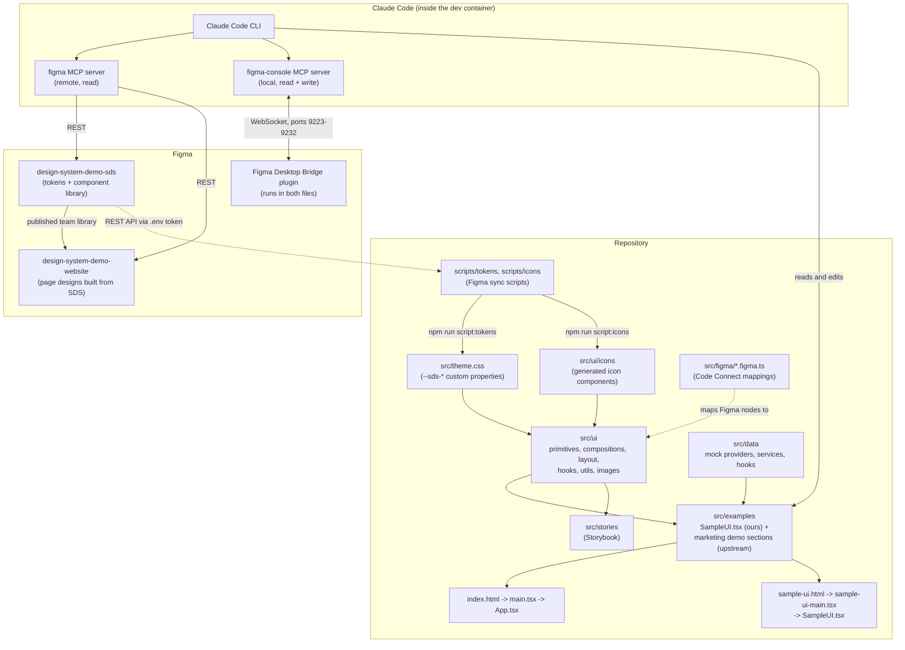
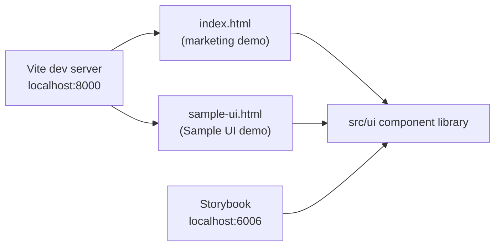
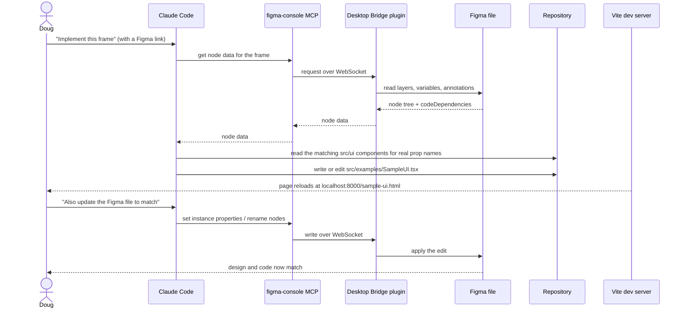
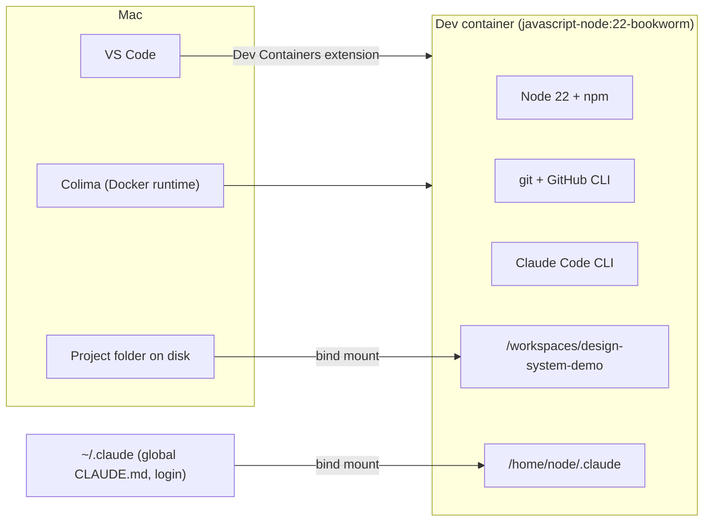

# Architecture

This document shows how the pieces of design-system-demo fit together and
how a Figma design becomes React code. See `PRD.md` for what the project is
for and `CLAUDE.md` for working rules.

## System overview

Three worlds meet in this repo: the Figma files, the tools that read and
write them, and the code itself.

### The three kinds of source files

| Kind         | Where                                                                                                                     | Who changes it                                   |
| ------------ | ------------------------------------------------------------------------------------------------------------------------- | ------------------------------------------------ |
| Generated    | `src/ui/icons/`, `src/theme.css`                                                                                          | Only the sync scripts. Never hand-edit.          |
| Upstream SDS | Everything else under `src/ui/`, `src/data/`, `src/figma/`, `src/stories/`, and the marketing sections in `src/examples/` | Left as written. Touch only for necessary fixes. |
| Ours         | `src/examples/SampleUI.tsx`, `src/examples/sample-ui-theme.css`, `src/sample-ui-main.tsx`, `sample-ui.html`               | Follows the global code-style rules.             |

## Build and run

Two HTML entry points share one component library. Vite serves both in
development and builds both into `dist/`.

Both `tsconfig.json` and `vite.config.ts` define the same bare import
aliases (`primitives`, `compositions`, `layout`, `icons`, `hooks`, `utils`,
`images`, `data`). Storybook repeats them in `.storybook/main.ts`. Keep all
three in sync.

## How a Figma design becomes code

This is the loop we practice in the project. The Sample UI page and each of
its follow-up fixes went through it.

Rules that keep this loop honest live in `CLAUDE.md` under "Figma MCP /
Code Connect workflow": extract the design first, map to existing
components, read the real `.tsx` files for prop names, respect the
annotation attributes, skip hidden nodes, and use tokens and layout
components rather than custom CSS.

## Development environment

Everything that executes runs inside the container. The project folder is
bind-mounted, so edits made from the Mac or from inside the container are the
same files. The Mac's `~/.claude` folder is mounted too, so Claude Code inside
the container reads the global rules and keeps its login across rebuilds.
`.devcontainer/post-create.sh` installs dependencies, installs Claude Code,
and makes bash and zsh load `.env` so the Figma token reaches `.mcp.json`.
